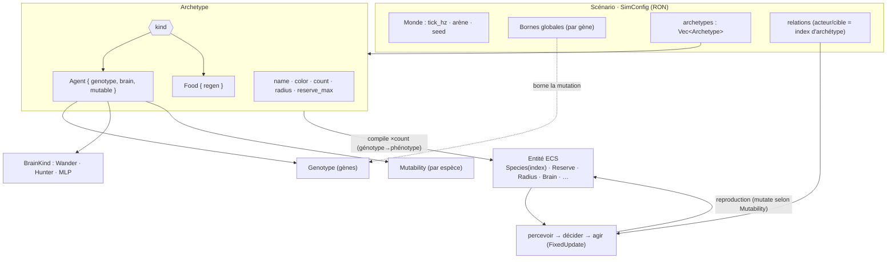

# Moteur de simulation évolutive — Synthèse de conception

> Document de référence. Vue 2D top-down, entités = ronds. **Un seul moteur** ; chaque
> simulation (sélection naturelle, bataille, …) est un *fichier de scénario*.

---

## 0. État du projet (où l'on en est)

Résumé vivant ; le détail par item vit au §8 (ordre d'implémentation) et les chantiers
ouverts au §9.

**Fait.**

- **P0–P3** (fondations, boucle jouable, interface, capture vidéo) : réalisés.
- **P4 — sélection naturelle approfondie + intelligence évoluée** (régime continu),
  items 15–18 : réalisés. Éditeur générique de gènes (valeur/bornes/**mutable**),
  `Brain::Hunter`, proie-prédateur co-évolutif, cerveau **par espèce** + héritage, **MLP
  fait maison + neuroévolution** (+ graphe), précision visuelle évolutive, généalogie.
- **Item 18d — archétype-first** (Phase 1 de « tout est entité ») : `archetypes:
  Vec<Archetype>` est la donnée centrale ; l'espèce est une unité de premier ordre
  (corps + décideur + couleur + effectif), son index est son identité, la nourriture en
  est un archétype (plus de collision de numéros). Mutabilité **et** génotype fondateur
  **par espèce** ; relations adressées par archétype ; éditeur de création/suppression.
  Scénarios migrés et triés (11 → 7).
- **Item 18e — fuite active** (canal « menace ») : un canal de perception `threat`,
  *symétrique inverse* du canal « cible » (il s'allume quand le hit le plus proche est une
  espèce qui peut agir **sur nous**, relation inverse). `Brain::Hunter` gagne un **réflexe
  de fuite par subsomption** (§4) : au-delà d'un seuil de proximité, la survie
  court-circuite le fourrage. *Même* cerveau partagé → une proie **détale** quand son
  prédateur approche, un prédateur de sommet reste un pur chasseur (le pendant, côté fuite,
  de l'insight de l'item 17). Driver `tests/flight.rs` (miroir de `hunter.rs`) ;
  `proie_predateur` recalibré (arène élargie = refuges, la leçon spatiale de l'item 17).
- **Phase 2 — finitions d'éditeur + bibliothèque d'espèces** : l'éditeur d'archétypes sait
  **dupliquer** (clone en fin de liste, relations non copiées) et **réordonner** (▲/▼, avec
  *transposition* des index dans la table de relations), en plus de créer/supprimer. Et une
  espèce est désormais une unité **sérialisable, réutilisable** entre scénarios (item 4) :
  export vers `species/*.ron`, import par **copie** (le scénario reste autonome, §9) avec un
  lien de provenance (`Archetype.source`, additif/rétro-compatible) pour une
  **resynchronisation** qui préserve l'effectif local.
- **Paramètres de monde dans l'UI** : `tick_hz` (cadence de sim, « (reset) » — ré-appliquée
  au reset, le point de passage unique que le rechargement de scénario déclenche aussi) et
  les **bornes de gènes** (`*_bounds`, section « Bornes des gènes » — une par entrée de
  `TRAITS`, soit 10 à l'époque, **12** depuis les deux gènes de flore) rejoignent l'éditeur,
  via un accesseur `TraitSpec::bounds_mut` (boucle sur `TRAITS` → DRY). Plus aucun paramètre
  de scénario réservé au RON.
- **Phase 3a — flore évolutive réelle** (item 5) : une *flore* devient une entité de plein
  droit, **sans nouveau système cœur**. Génotype variable par **superset** (choix tranché,
  §9) : `Genotype` gagne `photosynthesis` (gain d'énergie passif) et `seed_dispersal`
  (distance de semis) — gènes **non mutables par défaut** (RNG-safe ; les drivers existants
  restent bit-à-bit identiques). `metabolize` intègre la photosynthèse au bilan ; `reproduce`
  sème à `seed_dispersal` ; `Brain::Sessile` est le cerveau trivial (no-op). La **capacité de
  charge émerge** d'une compétition intraspécifique exprimée par la **primitive d'interaction**
  (relation Plante→Plante sans transfert, §3) — aucun mécanisme nouveau. Driver `tests/flora.rs`
  (`scenarios/flore.ron`, 4 graines) : la flore croît ~20×, reste **bornée loin de la saturation**
  et **persiste**.
- **Phase 3b — dissolution de `Food`** (item 18h) : le type spécial `Food` n'existe plus.
  `ArchetypeKind` est **aplati** — *tout archétype est un agent* (`Archetype` porte directement
  `genotype`/`brain`/`mutable`) ; une *source de nourriture* est un patch **sessile
  photosynthétique** (`Brain::Sessile`, `photosynthesis > 0`, reproduction coupée), renouvelé sur
  place, effectif fixe. Supprimés : `replenish_food`/`regen`/`FoodRegen`/`spawn_food*`/`FoodSnap`/
  le composant `Food` ; snapshot, éditeur et visuels unifiés sur l'agent. La dissolution a **révélé
  un défaut de conservation** dans la primitive d'interaction (§3) : N fourrageurs agglutinés sur un
  même patch en recevaient chacun la pleine valeur → énergie créée. `interact` met désormais les
  prélèvements **à l'échelle de la réserve disponible** de la cible (deux passes, indépendant de
  l'ordre) — conservation stricte. RON cassant (schéma plat) : 6 scénarios + la bibliothèque migrés ;
  `cohabitation`/`cerveau_mlp` **recalibrés** (nourriture sparse-et-lente : un fourrageur efficace
  garde les patchs épuisés → l'exclusion compétitive tient). Tous les drivers reverdis.
- **Menace câblée dans l'appris** (item 18g) : le canal `threat` (item 18e), jusqu'ici consommé par
  le seul chasseur déterministe, rejoint l'**entrée du MLP** — `vision|cible` (`2 × rayons`) →
  `vision|cible|menace` (`3 × rayons`, constante `MlpBrain::CHANNELS`). La couture de
  redimensionnement par bloc de `reproduced` passe de 2 à 3 blocs (DRY sur `CHANNELS`) ; l'appris
  reçoit donc de quoi *apprendre* à fuir, là où le chasseur applique un réflexe câblé — exactement
  comme `target` (chasseur item 16 → MLP item 18b). Flux RNG des scénarios **non-MLP intact** (aucun
  MLP construit) ; les scénarios MLP ont un réseau plus large — `tests/mlp` revalidé (domination sur
  les 5 graines préservée). Unité `mlp_reads_threat_channel` : preuve falsifiable que le canal n'est
  plus ignoré (deux perceptions ≠ par la seule menace → actions ≠).
- **Visualiseur natif Bevy + réagencement du HUD** : un second backend de rendu des panneaux
  d'observation (stats, courbes, inspecteur) **en Bevy** (Text2d + Sprite + gizmos), pour qu'ils
  soient **filmables** — l'overlay egui, lui, ne l'est jamais (§7). La *donnée* est partagée via une
  couche commune montée dans la lib (`metrics` : `History` + `sample_history`, `live_stats`,
  `population_curves`/`trait_curves`) → **exactement** les mêmes nombres/courbes qu'egui, deux tracés.
  Composition **fixe 9:16** : arène carrée en haut, visualiseur en bas (viewports + caméras
  d'encadrement créées **en lazy** à l'activation — sinon >1 `Camera2d` casse le contexte primaire
  egui), avec **rotation** des sections (courbes ↔ inspecteur) à intervalle configurable quand la
  place manque. *Un seul chemin de rendu* (`dataviz::DataVizPlugin`) : le mode **présentation** du
  fenêtré (touche **F1**, masque egui) est strictement identique à la vidéo. `record` l'active **par
  défaut** (cible 1080×1920 ; `--no-hud` → ancienne sortie carrée 1080×1080 ; `--hud-interval`).
  Police **DejaVu Sans** embarquée (`assets/fonts/`, 1er asset du dépôt) car la police Bevy par défaut
  est ASCII-only (accents, noms de gènes inclus). Panneaux egui ré-agencés **sémantiquement** :
  *monde* à gauche, *entités* à droite, *scénario + enregistrement* en bande du haut, *contrôles +
  stats* puis *courbes + inspecteur* en bas. **Snapshots de run supprimés** (item 13, inutilisés) :
  UI, systèmes, `src/snapshot.rs` et `tests/snapshot.rs` retirés intégralement.
- Outillage : enregistrement vidéo (re-render headless via ffmpeg, défauts 30 fps / 61 s),
  drivers de test multi-graines (`predator_prey`, `mlp`, `cohabitation`, `flight`, `flora`, …),
  `clippy`/`fmt` propres.

**Reste à faire.**

- **P5 — bataille (différée) + passage à l'échelle** : régime générationnel (run → score
  → breed), headless parallélisé inter-matchs, puis crossover de poids / NEAT (§9).

---

## 1. Principe directeur

Un seul **moteur** interprète de la donnée. La boucle est invariante — **percevoir → décider →
agir** — et ce qui varie d'un scénario à l'autre est la configuration, pas le code.

La modularité tient en **un axe à trois auteurs** (qui écrit le comportement et la structure ?) :

| Auteur | Moment | Décision via… | Corps via… |
|---|---|---|---|
| **Moteur** | compile-time | systèmes qui interprètent la donnée | composants et leurs effets |
| **Designer** | config-time | cerveau déterministe (règles) | valeurs de l'éditeur d'archétypes |
| **Évolution** | run-time | poids du réseau de neurones | gènes qui mutent |

L'axe s'applique deux fois : à la **décision** et au **corps**.

---

## 2. Contrats (invariants)

Les casser fait perdre la modularité.

- **Cerveau et corps = un contrat** : `floats normalisés en entrée → floats en sortie`. L'intérieur
  (réseau de neurones, arbre de décision, FSM) est interchangeable.
- **Stockage en `enum`, pas `Box<dyn>`** : dispatch statique, `serde` propre, `match` exhaustif
  vérifié à la compilation. Le crossover est intra-type (on ne croise pas un NN avec une FSM).
- **Le corps impose la forme des I/O du cerveau.** Les gènes font varier les *magnitudes* (portée de
  vision, vitesse) **et**, depuis le gène `vision_rays` (item 18c), le *nombre de canaux* (la précision
  visuelle) : la couche d'entrée du MLP s'y adapte à la reproduction — un premier pas vers la topologie
  variable. La topologie *cachée* reste fixée au fondateur ; le NEAT complet (cf. item 21) est toujours
  repoussé.
- **Génotype ≠ phénotype** : on mute le génotype (description héritée), compilé en phénotype vivant
  (composants Avian + cerveau) au spawn. L'évolution ne touche jamais l'état physique courant.
- **Une caractéristique = (valeur, bornes, couplage de coût)** — plus, à l'édition, un facet
  **mutable ?** : le gène a-t-il le droit de muter (dériver, transmettre de la variation sélectionnable),
  ou reste-t-il figé à la valeur du fondateur ? Il est **transmis dans les deux cas** ; la case ne
  gouverne que la mutation (d'où *mutable*, pas *héritable*). Sans coût, tout converge vers le maximum et
  rien n'émerge ; le coût est défini par le scénario, pas par le moteur.

---

## 3. Primitive d'interaction unique

Manger et attaquer sont la même **interaction dirigée** : A réduit une ressource de B, à
portée/contact.

- **Prédation** : attaque qui *transfère* l'énergie à A.
- **Combat** : attaque qui *détruit* sans transfert.

Le moteur n'expose qu'**une primitive**. Le scénario en fixe la sémantique : la ressource (énergie /
PV), transfert ou non, et le filtre de cible (relation trophique prédateur→proie, ou camp
ennemi→ennemi). De même pour la perception : les requêtes spatiales sont de la machinerie moteur ;
le scénario choisit seulement *quels* canaux deviennent des entrées du cerveau.

---

## 4. Contrat de scénario et régimes évolutifs

Un scénario définit :

- **Spawn** : qui, où, combien, quels camps.
- **Vocabulaire** : actions et capteurs disponibles.
- **Table d'interactions** : qui agit sur qui, ressource visée, transfert ou non.
- **Couplages de coût** : ce que coûte chaque trait (vision → métabolisme, vitesse → énergie).
- **Conditions** : de mort, de fin.
- **Régime évolutif** : voir ci-dessous.

### Les régimes comme grille d'axes

Un régime n'est pas un atome mais un point dans une grille de deux axes largement indépendants :

- **Axe A — timing de reproduction** : *continu* (dans la sim, à la mort / à un seuil) ↔ *par lots*
  (à une frontière de génération, hors-sim).
- **Axe B — source de fitness** : *implicite / écologique* (émergente du monde) ↔ *explicite / par
  score* (calculée → sélection → reproduction).

| | Fitness implicite | Fitness explicite |
|---|---|---|
| **Repro continue** | **Sélection naturelle** | steady-state GA |
| **Repro par lots** | régime « saisonnier » | **Bataille** |

Les deux régimes canoniques occupent la diagonale ; les cases hors-diagonale sont des régimes
valides. Un continuum existe le long de l'axe A (*generation gap*). Les axes ne sont pas parfaitement
orthogonaux — la fitness implicite impose une sélection écologique —, ce qui fait des deux coins
diagonaux des configurations cohérentes ; l'axe A reste libre.

**Garde architecturale.** Ne pas réifier `enum Regime { Continuous, Generational }` : ce serait figer
le couplage dans le type (généralité ≠ modularité). Garder deux **coutures séparables** : « où vit la
reproduction » (système de sim en continu ↔ orchestrateur hors-sim en générationnel) et « d'où vient
la fitness » (émergente ↔ calculée). Critère de validité : un troisième régime doit être une
*recomposition* de ces pièces, jamais un cas spécial.

### Coexistence des types de cerveau

1. **Substitution** : échanger NN / déterministe par espèce (gratuit via le contrat).
2. **Cohabitation** : le déterministe sert de groupe témoin (un NN qui ne le bat pas n'a rien appris)
   et d'échafaudage (valider le pipeline avant que les NN existent).
3. **Hybridation** : réflexes en dur (fuir à PV critiques) court-circuitant la couche apprise
   (architecture de subsomption).

---

## 5. Stack technique

| Couche | Choix | Note |
|---|---|---|
| ECS / moteur | **Bevy 0.18** | adapté aux simulations lourdes |
| Physique | **Avian 0.6** | natif Bevy ; collisions **et** raycasting d'occlusion |
| HUD / courbes | **bevy_egui** | population, dérive des traits en temps réel |
| Sérialisation | **serde + RON** | archétypes lisibles ; binaire pour les snapshots |
| Cerveau | **fait maison** (MLP + mutation/crossover) | les libs ML visent le gros réseau GPU, l'inverse du besoin |
| Vidéo | **ffmpeg** | alimenté par re-render (§7) |

**Arbitrages :**

- **Performance > déterminisme strict** : parallélisme actif (intra- et inter-match), pas de
  `enhanced-determinism`.
- **Occlusion visuelle requise** : raycasting comme mécanisme de vision.
- **Timestep fixe** : pour la stabilité du solveur (un dt variable diverge), non pour le déterminisme.
- **Broad-phase Avian** comme structure de voisinage : pas de spatial hash maison.
- **RNG seedé** : pour rejouer une *configuration d'expérience* et comparer des paramètres, non pour
  la reproductibilité bit-à-bit (abandonnée avec le parallélisme).

---

## 6. Modèle d'exécution : headless ⇄ direct

Toute la logique de sim et la physique Avian vivent dans le schedule à timestep fixe (`FixedUpdate` /
`FixedPostUpdate`), identique avec ou sans fenêtre. Seuls changent le pilote de boucle et les plugins
de rendu.

- **Direct** : `DefaultPlugins` (winit pilote, rend, présente).
- **Headless** : `ScheduleRunnerPlugin`, sans fenêtre ni rendu.

> **Invariant : aucune logique de sim dans `Update`** (rendu, input, UI uniquement). Sinon le
> headless diverge du direct.

**Deux horloges** : la cadence de sim (timestep fixe, **64 Hz** par défaut) est constante et
indépendante de la cadence de rendu (`Update`, calée sur la vsync). Bevy exécute le schedule fixe 0,
1 ou plusieurs fois par frame pour rattraper le temps écoulé.

- **Débit headless** : piloter le schedule manuellement en boucle serrée (jusqu'à la condition de
  fin), pas via l'accumulateur temps-réel → nombre de ticks reproductible, vitesse maximale.
- **Pause / vitesse** : `Time<Virtual>::pause()` et `set_relative_speed(x)` (l'horloge fixe suit).
- **Spirale de la mort** : si un tick dépasse le temps réel, le rattrapage s'empile. `set_max_delta()`
  plafonne le rattrapage ; à régler quand le nombre d'entités croît.
- **Évolution générationnelle** : matchs headless parallélisés inter-matchs, un `World` isolé et une
  seed par match — c'est là que le débit croît.

---

## 7. Difficultés identifiées

- **Vidéo** : sans déterminisme, pas de rejeu par seed. Solution par défaut : re-render frais du
  meilleur génome (représentatif, pas le match historique exact). Alternative exacte : logger puis
  rejouer les trajectoires.
- **Vision par raycast** : goulot potentiel (N entités × M rayons × tick). Spatial queries Avian,
  rayons/portée plafonnés par espèce, vision traitée comme un coût pour borner la dérive.
- **Sélection naturelle** : le point de calibration central est l'**économie d'énergie**. Mal
  calibrée → effondrement ou explosion ; cycles de Lotka-Volterra (proie-prédateur) à stabiliser.
- **Bataille** : le comportement émergent reflète la **fonction de fitness** (récompenser les kills →
  kamikazes ; la survie → évitement). Co-évolution des camps → instabilité (Reine Rouge).

---

## 8. Ordre d'implémentation

Principe : bâtir la fondation découplée d'abord, valider chaque tranche avec des agents déterministes
(échafaudage), réaliser un scénario de bout en bout avant de généraliser. Le second scénario d'un
type donné sert de test : si l'abstraction tient, il est presque entièrement de la configuration.

Trois principes de méthode :

- **Généralité ≠ modularité** : un mécanisme général peut être profondément couplé ; la modularité ne
  se falsifie que contre la **pluralité** (≥ 2 instances par axe).
- **Éditeur piloté par les scénarios** : chaque brique naît d'un besoin réel et prouvée modulaire ;
  « éditeur complet » est un résultat, pas un préalable.
- **Stub le comportement, jamais le schéma** : une coquille de comportement (cerveau no-op) est un
  échafaudage légitime ; une coquille de contrat de données fige la mauvaise forme — la forme du
  schéma *est* l'abstraction.

Objectif : une **plateforme d'expériences** mesurant ce qu'un cerveau appris apporte face à un groupe
témoin déterministe. La sélection naturelle (régime continu) est approfondie en premier ; elle porte
déjà prédation, compétition et co-évolution (cf. Avida, Tierra, Polyworld). Le régime générationnel
(bataille) est différé comme test final de l'axe A.

### P0 — Fondations (réalisé)

1. Bevy + Avian, ronds rigides, collisions, caméra 2D ; sim dans `FixedUpdate` / `FixedPostUpdate`.
2. Boucle percevoir→décider→agir avec un cerveau déterministe trivial (errance).
3. Deux entrées partageant le même schedule : direct (`DefaultPlugins`) et headless
   (`ScheduleRunnerPlugin`, comptage de ticks fixes jusqu'à la condition de fin).

### P1 — Moteur jouable : boucle évolutive continue (réalisé)

4. Placement : drag-and-drop manuel + spawn aléatoire en nombre (éditeur fenêtré).
5. Éditeur d'archétype + save/load RON ; distinction archétype (config) / génome (instance).
6. Vision par raycast avec occlusion (spatial queries Avian) ; coût métabolique couplé portée × rayons.
7. Primitive d'interaction unique (prédation/combat) + table de relations par espèce.
8. Scénario nº1 — sélection naturelle : métabolisme, alimentation, mort à zéro, réensemencement.
9. Reproduction + mutation d'un génotype paramétrique → boucle évolutive continue ; repousse à débit
   fini → capacité de charge (`scenarios/evolution.ron` : population stable, dérive des gènes).

### P2 — Interface (réalisé)

Outillage d'observation et de pilotage, entièrement dans le binaire fenêtré (`Update` / egui).

10. HUD / courbes : population par espèce, dérive des traits normalisés (lecture seule). Donnée
    factorisée dans `metrics` et tracée par deux backends (egui + natif Bevy, cf. §0).
11. Contrôles : pause, vitesse 0.5×–8×, pas-à-pas, reset (pilotage de `Time<Virtual>` ; le reset
    reconstruit le monde depuis `SimConfig`).
12. Inspecteur d'agent : génotype, réserve, perception, action courante (lecture seule).
13. Runs/scénarios à chaud : sélecteur RON + sauver/charger par chemin, recharge sans relancer le
    binaire. *(Les snapshots de run, jadis sérialisés ici, ont été retirés — cf. §0.)*

### P3 — Capture vidéo (réalisé)

14. Rendu headless → `ffmpeg` (pipe direct des frames, sans PNG intermédiaire ; re-render frais).
    Menu d'enregistrement intégré au build fenêtré (lance `record` en sous-process). Rendu de la sim
    factorisé (`VisualsPlugin`) partagé fenêtré ⇄ enregistreur. **HUD natif incrustable** (stats /
    courbes / inspecteur en Bevy, composition 9:16 ; `--hud` par défaut, `--no-hud`), partagé avec le
    mode présentation du fenêtré via `DataVizPlugin` + `MetricsPlugin` (cf. §0).

### P4 — Sélection naturelle approfondie + intelligence évoluée (régime continu, en cours)

L'évolution d'intelligence est la frontière de l'abstraction *dans* la sélection naturelle. L'éditeur
grandit ici, piloté par ces scénarios — à ce jour : gènes d'archétype (valeur/bornes/**mutable**, dont
la **précision visuelle** `vision_rays`), cerveau **et réserve max par espèce** (sélecteur de cerveau
ciblé sur l'espèce sélectionnée + description fonctionnelle, **architecture & graphe du MLP**),
**paramètres de monde** (arène, économie de nourriture, table de relations), placement et
**suppression** d'entités (touche Suppr). L'inspecteur, lui, montre le **MLP en action** (activations),
plus la **généalogie** (génération, âge).

15. Éditeur générique de caractéristiques **(réalisé)** : (valeur, bornes) + toggle « mutable ? »
    par trait — table `TRAITS` + facet `Mutability` (renommé depuis `Heritability` à l'item 18c : la
    case gouverne la mutation, pas l'hérédité), exposés sans code dédié par éditeur/HUD/
    inspecteur ; reproduction, métabolisme et coût de locomotion migrés en gènes — **et** sélecteur de
    cerveau, chaque variant de `Brain` exposant ses propres paramètres éditables (`turn_rate` pour
    l'errance, aucun pour le chasseur) via un `BrainKind` *porteur de données*. Le sélecteur édite par
    *kind* et expose les paramètres du variant par un `match` exhaustif : la contrepartie *hétérogène*
    (un cerveau = ses propres champs) de la table `TRAITS`, elle *homogène*. (La part « sélecteur » est
    venue après l'item 16, qui en fournit le 2ᵉ variant falsifiant.)
16. `Brain::Hunter` déterministe **(réalisé)** : réflexe utilisant la perception. Un **champ de pilotage
    unifié** où chaque rayon pousse d'un poids `attraction·cible + dégagement` : la cible *attire*
    (gradué par la proximité), un obstacle non-cible (mur, autre entité) se *contourne* sans qu'on le
    fuie — la nourriture n'est donc plus évitée comme un mur. L'« attaque au contact » reste la
    primitive d'interaction (item 7), le chasseur n'a qu'à venir au contact. A nécessité d'étendre la
    perception d'un **canal « cible »** par rayon (le hit le plus proche est-il une espèce visée par la
    table de relations ?) — driver réel de l'extension du schéma. Sélection du cerveau par scénario
    (`BrainKind`, RON : `Wander(turn_rate: …)`/`Hunter` ; `scenarios/chasse.ron`). Groupe témoin
    compétent ; rend le chemin percevoir→décider→agir porteur et le sélecteur de cerveau falsifiable
    (2ᵉ variant de `Brain`). **Reste** : substitution *par espèce* (cohabitation témoin/appris, §4).
17. Proie-prédateur co-évolutif **(réalisé)** : `scenarios/proie_predateur.ron`, une **chaîne
    trophique à trois niveaux** (plantes → proies → prédateurs) où le *même* `Brain::Hunter` partagé
    fait d'une proie un herbivore et d'un prédateur un carnivore — le canal « cible » (item 16) se
    résout **par espèce qui perçoit** via la table de relations, si bien que deux relations enchaînées
    (prédateur→proie, proie→plante) suffisent à distinguer les rôles. La méthode « éditeur piloté par
    les scénarios » a joué pleinement : la version **pure donnée** (round-robin → 50 % de prédateurs)
    s'est avérée un *knife-edge* (coexistence pour ~2 graines sur 5, effondrement sinon) — la cause
    structurelle (ratio forcé, pas de pyramide possible) a **fait naître l'unique croissance de
    schéma** : un champ **`agents_per_species`** (effectif par espèce → pyramide « proies ≫
    prédateurs »), vivant dans `config` + `spawn` (+ `species_cardinality()` pour HUD/éditeur), **zéro
    édition de `movement` / `interaction` / `ecology`** et **rétro-compatible** (vide → l'ancien
    partage uniforme ; aucun `.ron` à migrer). L'archétype reste *partagé* entre espèces — seul
    l'effectif diffère. Calibration (§7) : le stabilisateur décisif des cycles de Lotka-Volterra s'est
    révélé **spatial** (grande arène = refuges des proies + cueillette plafonnée), pas un réglage fin ;
    prédation modérée et seuil de reproduction modéré amortissent l'oscillation. **Driver**
    `tests/predator_prey` — multi-graines (5 mondes indépendants), il encode le critère de
    falsification : (a) *bande de population* — aucune lignée éteinte ni explosive sur la 2ᵉ moitié,
    pour toutes les graines ; (b) *dérive attendue* — la vision **se maintient** (le chasseur s'en
    sert : ~110-290 selon la graine, fondateur 170), au lieu de fondre vers la borne basse comme sous
    l'errance (contraste falsifiable avec `evolution.ron`). **Reste** : substitution de cerveau *par
    espèce* (cohabitation témoin/appris, §4) et l'**archétype complet par espèce** (gènes fondateurs +
    cerveau distincts ; couture du founder de §9), différés jusqu'à un scénario exigeant des *corps*
    distincts. La **fuite active** d'une proie, elle, est **faite** (item 18e, canal « menace ») — et
    a motivé la recalibration spatiale du scénario (arène 480 → 560) qui synergise avec elle.
18a. Couture « cerveau par espèce » + héritage du cerveau **(réalisé)** : le prérequis que les items
    16 et 17 réservaient en « Reste » (substitution *par espèce* — cohabitation témoin/appris, §4).
    Deux coutures, falsifiées avec les cerveaux **déterministes existants** avant que le MLP n'arrive
    (« stub le comportement, jamais le schéma », §8). (1) `brains_per_species` fonde un cerveau par
    espèce — calqué sur `agents_per_species` (item 17), **additif et rétro-compatible** (vide →
    `brain` uniforme ; `brain_of` résout, repli sur l'uniforme ; zéro `.ron` à migrer) ; l'archétype
    (le *corps*) reste **partagé**, seul le cerveau (l'*auteur de la décision*) diffère. (2) À la
    reproduction, l'enfant **hérite du cerveau du parent** (`Brain::reproduce`) au lieu d'être
    reconstruit depuis le config global — sinon les lignées convergeraient vers le cerveau uniforme ;
    c'est la couture que la neuroévolution (18b) étendra pour **muter les poids**. Flux RNG préservé
    (mêmes tirages qu'avant → `predator_prey`/`snapshot` inchangés). Éditeur : sélecteur de cerveau
    **par espèce** dès qu'il y en a plusieurs, + **description fonctionnelle** de chaque variant
    (`BrainKind::description`, contrepartie hétérogène de `name`). **Driver** `tests/cohabitation`
    (`scenarios/cohabitation.ron`, 5 graines) : chasseur (témoin compétent) vs errance (témoin naïf),
    **même corps et même économie**, nourriture commune — seul le cerveau diffère. Critère en trois
    volets : (a) *invariant d'héritage* — tout descendant d'espèce 0 reste chasseur, d'espèce 1 reste
    errant ; (b) *reproduction effective* — les chasseurs croissent au-delà de leurs fondateurs ; (c)
    *domination du témoin* — exclusion compétitive nette (~110 chasseurs contre ~1 errant), le §4
    réalisé : « un cerveau qui ne bat pas le déterministe n'a rien appris ».
18b. MLP fait maison + neuroévolution (cœur) **(réalisé)** : le cerveau **appris**, dans le régime
    continu, **en substitution par espèce** (la couture 18a). `Brain::Mlp` — perceptron multicouche
    fait maison (couches denses `tanh`, init Xavier seedée). **Entrées** = canaux normalisés
    `vision`/`target` concaténés (`2 × vision_rays`, pas la géométrie `ray_dirs`) ; **sortie** = 2
    neurones lus comme un vecteur de pilotage *en repère du corps*, tourné vers le monde par
    `perception.heading` → orientation-équivariant (le réseau n'apprend pas l'orientation absolue).
    **Neuroévolution** : `Brain::reproduce` étendu — l'enfant hérite la topologie et **mute ses poids**
    (perturbation gaussienne d'écart `mutation_rate · WEIGHT_STEP`) ; crossover sur poids repoussé
    (permutation, §9), mutation-seule d'abord. Flux RNG des scénarios non-MLP préservé (Wander/Hunter ne
    tirent pas). **Architecture éditable** (numérique) : `BrainKind::Mlp { hidden }` porte la topologie
    des **couches cachées** (nombre + largeur) ; entrée/sortie restent *contraintes* par le contrat
    (topologie cachée = choix de designer fixé au fondateur, **non muée** — NEAT/topologie variable
    toujours repoussée, §2/item 21). **Driver** `tests/mlp` (`scenarios/cerveau_mlp.ron`, 5 graines) :
    cohabitation MLP vs errance, **même corps et même économie**, nourriture commune et limitée — partant
    de poids **aléatoires**, le MLP passe de la parité (~145/145) à la **domination** par exclusion
    compétitive (~220 contre ~10, errance quasi éteinte) sur **chaque** graine — le §4 réalisé pour le
    cerveau appris. **Finding (§7)** : la neuroévolution depuis l'aléatoire, en tête-à-tête, est à forte
    variance (une cohorte initiale médiocre est exclue avant d'apprendre) ; le levier décisif est la
    **diversité des fondateurs** (40/espèce → 3 graines sur 5 ; 70 → les 5) — ce qui motive d'autant les
    lots générationnels de P5. **Reste** : les **visualisations graphe** (18b-viz).
18b-viz. Visualisation du MLP en graphe **(réalisé)** — purement de l'UI, sans changement de schéma
    (la couture 18a — un cerveau par agent, inspecteur lisant déjà `Brain` — l'accueille). API de lecture
    minimale sur `MlpBrain` (`layer_sizes`, `weight_layers`, `layer_weights`, `activations`) ; un
    dessinateur partagé `editor::draw_mlp_graph` (une colonne de nœuds par couche, arêtes entre colonnes,
    via `egui::Painter`). Deux usages : (a) **éditeur** — aperçu *structurel* (nœuds neutres) qui suit
    l'édition de l'architecture ; (b) **inspecteur** (item 12) — le réseau de l'agent sélectionné **en
    action** : nœuds colorés par l'**activation courante** de chaque neurone (le dernier `think`, échelle
    `tanh` froid<0<chaud) et arêtes teintées par signe/intensité du poids. L'item 18 (MLP +
    neuroévolution) est ainsi complet ; reste, plus loin (P5/§9), crossover sur poids + NEAT.
18c. Précision visuelle évolutive + généalogie + 1ᵉʳ corps par espèce **(réalisé)** : trois extensions
    de la machinerie existante, sans système cœur nouveau. (1) **`vision_rays` devient un gène**
    (10ᵉ entrée de `TRAITS`, ajoutée en *fin* pour préserver le flux RNG des autres traits ; stocké en
    `f32`, arrondi au phénotype) : la précision visuelle varie par individu, mutable et bornée par son
    coût métabolique déjà couplé (portée × rayons). La couche d'entrée du **MLP s'adapte** à la précision
    de l'enfant à la reproduction (`MlpBrain::reproduced` : resize par bloc `vision|cible`, poids neufs
    Xavier, identité à précision constante) — *brèche* assumée dans « forme verrouillée » (§2), premier
    pas vers la topologie variable. (2) **Généalogie** : composants `Generation` (0 au fondateur,
    parent+1 à la repro) et `Age` (secondes simulées, `ecology::age_agents` en `FixedUpdate`), capturés
    au snapshot et affichés à l'inspecteur. (3) **Réserve max par espèce** (`reserve_max_per_species`,
    `reserve_max_of`) — calqué sur `brains_per_species`, additif/rétro-compatible — éditée par espèce ;
    le **% de remplissage** reste normalisé `[0,1]` (`Reserve::fraction`), donc comparable. Le premier
    levier du *corps* par espèce (§9, « archétype par espèce »), après l'effectif (17) et le cerveau
    (18a). Renommage `Heritability → Mutability` (la case gouverne la mutation, le gène est transmis dans
    tous les cas). Éditeur de cerveau désormais **ciblé sur l'espèce sélectionnée**. UX : « Recharger
    dans le monde » repart **en pause** (monde neuf figé, à placer/éditer avant lancement).
18d. **Archétype-first** (Phase 1 de « tout est entité ») **(réalisé)** : la donnée centrale du
    scénario devient `archetypes: Vec<Archetype>` — chaque entrée est une *espèce de premier ordre*
    (`name`, `color`, `count`, `radius`, `reserve_max`, `kind`), et son **index** est son identité
    (`Species`). `ArchetypeKind` est un `enum` `Agent { genotype, brain, mutable }` / `Food { regen }` :
    la nourriture est un archétype comme un autre, avec son propre index → **fin de la collision** de
    numéros agent/nourriture. La **mutabilité passe par espèce** (dans `Agent`), le **génotype fondateur
    aussi** (corps distincts — résout le point ouvert « repli founder par espèce » du §9 pour les agents).
    Les vecteurs parallèles (`agents_per_species`, `brains_per_species`, `reserve_max_per_species`,
    `agent_radius_per_species`) et les champs `food_*` épars fusionnent dans les archétypes ; bornes,
    `tick_hz`, arène et graine restent globaux. Les **relations s'adressent par archétype** (menus
    déroulants dans l'éditeur, plus de numéros nus). L'éditeur crée/duplique/supprime des archétypes et
    écrit *directement* dans le `SimConfig` (plus de copie+synchro). Schéma RON cassant : tous les
    scénarios migrés, et triés (11 → 7). **Reste** (Phases 2-3) : finitions d'éditeur, puis la **flore
    évolutive** — `Food` dissous en un archétype à génotype sessile (le verrou `Genotype` variable du §9).

18e. **Fuite active** (canal « menace ») **(réalisé)** : une extension de la perception, sans
    système cœur nouveau, qui donne à une proie le réflexe de **fuir** son prédateur. (1) **Schéma** :
    un canal `threat` rejoint `vision`/`target` dans [`Perception`], *symétrique inverse* du canal
    « cible » de l'item 16 — il s'allume quand le hit le plus proche d'un rayon porte une espèce qui
    peut agir **sur nous** (`acts_on(autre, nous)`), là où `target` répondait à `acts_on(nous, autre)`.
    `perceive` lit l'espèce du hit **une seule fois** et la table dirigée tranche les deux sens. (2)
    **Comportement** : `Brain::Hunter` gagne un **réflexe de fuite par subsomption** (§4 — un réflexe
    de survie court-circuite la couche fourrage), et non une simple répulsion *ajoutée* au champ.
    *Pourquoi la subsomption* : avec N rayons, l'éventail des rayons dégagés somme vers l'avant ; une
    répulsion linéaire ne renverse jamais cette poussée pour une menace lointaine (un rayon contre tout
    le champ) sans constante absurde. Au-delà d'un **seuil de proximité** (`FLEE_THRESHOLD`), la proie
    bascule en fuite (s'éloigne des menaces ET des obstacles, sans attraction) ; en deçà, le mode
    fourrage de l'item 16 reste **strictement intact** — un prédateur lointain n'affame pas la proie,
    et les scénarios sans menace (chasse, cohabitation, MLP) sont *bit-à-bit inchangés*. Comme à
    l'item 17, le **même** cerveau partagé suffit : la relation inverse fait d'une proie un fourrageur
    qui détale, d'un prédateur de sommet un pur chasseur. (3) **Driver** `tests/flight.rs` — le miroir
    de `tests/hunter.rs` : une proie chasseur à l'origine, un prédateur **immobile** (épouvantail à
    débit nul) droit devant ; on vérifie (a) que le prédateur s'inscrit dans le canal « menace » de la
    proie, (b) qu'elle s'en **éloigne** franchement. **Recalibration** : la fuite déplace l'équilibre
    proie-prédateur (les proies échappent mieux) ; `proie_predateur` retrouve une coexistence robuste
    sur les 5 graines via le stabilisateur **spatial** de l'item 17 — arène `480 → 560` (refuges pour
    proies qui fuient), repousse de nourriture relevée, prédation un peu plus douce ; aucun système
    moteur touché. **Méthode** (« stub le comportement, jamais le schéma » ; valider sur le témoin
    avant l'appris) : le chasseur déterministe a consommé le canal d'abord, puis l'appris l'a reçu —
    exactement comme `target` (introduit sur le chasseur à l'item 16, consommé par le MLP à
    l'item 18b). Ce câblage MLP est **fait** (item 18g).
18f. **Flore évolutive** (Phase 3a) **(réalisé)** : une *flore* devient une entité de plein droit,
    **sans système cœur nouveau** — trois extensions de la machinerie existante. **Verrou levé** par
    **superset** (les trois sorties du §9 tranchées : une seule struct `Genotype` gagne les gènes de
    flore, la faune les laisse inertes — le chemin le plus sûr pour faire naître une flore *réelle*
    avant de réifier le split faune/flore, « falsifier contre ≥2 instances »). (1) **Gènes** :
    `photosynthesis` (énergie gagnée/s, passive) et `seed_dispersal` (distance de semis), ajoutés en
    **fin** de `TRAITS` et **non mutables par défaut** → `mutate` ne les tire pas pour les scénarios
    existants : flux RNG **intact**, `predator_prey`/`mlp`/`cohabitation` bit-à-bit inchangés. (2)
    **Mécanique** : `metabolize` intègre la photosynthèse au bilan net (gain − dépenses, clamp `[0,max]`
    — no-op pour la faune, manger plafonnant déjà à `max`) ; `reproduce` sème à `seed_dispersal` (repli
    rayon × 2.5 quand nul → faune inchangée, mêmes 2 tirages) ; `Brain::Sessile` est le cerveau trivial
    (no-op, accélérateur nul — « stub le comportement, jamais le schéma », §8). (3) **Auto-limitation
    sans nouveau mécanisme** : la capacité de charge **émerge** d'une compétition intraspécifique
    exprimée par la **primitive d'interaction** (§3) — une relation Plante→Plante *sans transfert*
    (lumière/espace disputés) qui draine les voisines proches ; densité haute → drain > photosynthèse →
    semis stoppé / mortalité → rétroaction négative **stable**. **Driver** `tests/flora.rs`
    (`scenarios/flore.ron`, 4 graines) : la flore croît ~20× depuis ses fondateurs, reste **bornée loin
    de la saturation physique** de l'arène (la compétition la freine en onde spatiale), et **persiste** à
    un effectif soutenu. Espèce *évolutive* : `reproduction_threshold` et `seed_dispersal` mutent sous la
    pression de la compétition. **Reste** (Phase 3b) : dissoudre le type spécial `Food` (`replenish_food`,
    `FoodSnap`, `spawn_food`) — il n'est plus que le cas dégénéré d'une flore (cerveau no-op, repro coupée).
18g. **Menace câblée dans l'appris** (canal `threat` → entrée du MLP) **(réalisé)** : le pas suivant
    naturel après que le chasseur déterministe a validé la fuite (item 18e), exactement comme `target`
    (introduit sur le chasseur à l'item 16, consommé par le MLP à l'item 18b — méthode « valider sur le
    témoin avant l'appris », §8). **Schéma** : la couche d'entrée du MLP passe de `vision|cible`
    (`2 × rayons`) à `vision|cible|menace` (`3 × rayons`), réifié en une constante `MlpBrain::CHANNELS`
    (= 3) — `input_size`, `input_vector` et la **couture de redimensionnement par bloc** de
    `MlpBrain::reproduced` (gène `vision_rays`, item 18c) y lisent un seul point de vérité (2 blocs → 3,
    DRY). L'appris reçoit ainsi de quoi **apprendre** à fuir, là où le chasseur applique un réflexe câblé
    par subsomption. **RNG-safe** : aucun cerveau non-MLP n'est touché (Wander/Hunter/Sessile ne lisent
    pas l'entrée) → `predator_prey`/`cohabitation`/`snapshot` **bit-à-bit inchangés** ; seuls les
    scénarios MLP ont un réseau plus large (plus de tirages Xavier à la construction) — `tests/mlp`
    **revalidé**, la domination MLP > errance tient sur les **5 graines** malgré l'entrée élargie (le
    canal menace est nul dans `cerveau_mlp`, sans prédateur ; il n'ajoute pas de signal mais ne nuit pas).
    **Driver** unité `mlp_reads_threat_channel` : deux perceptions identiques *sauf le canal menace* →
    actions **différentes** — la preuve falsifiable, côté appris, que le canal n'est plus ignoré (on ne
    prescrit pas *comment* un réseau aléatoire y répond, seulement qu'il y répond ; **bien** fuir relève
    de la sélection, comme le fourrage). **Reste** : un scénario *écologique* où une proie MLP doit
    apprendre la fuite (calibration Lotka-Volterra, §7) — différé, comme le bénéfice se mesure mieux en
    lots générationnels (P5, le finding de variance de l'item 18b).
18h. **Phase 3b — dissolution de `Food`** (le bout de « tout est entité ») **(réalisé)** : le type
    spécial `Food` est supprimé. (1) **Schéma aplati** : `ArchetypeKind` (l'`enum` `Agent`/`Food`)
    disparaît — `Archetype` porte *directement* `genotype`/`brain`/`mutable`, *tout archétype est un
    agent*. Une *source de nourriture* est un **patch sessile photosynthétique** (`Brain::Sessile`,
    `photosynthesis > 0`, `reproduction_threshold: 0` → effectif fixe), renouvelé **sur place** au lieu
    de réapparaître ailleurs. Supprimés : `replenish_food`/`regen`/`FoodRegen`, `spawn_food*`, `FoodSnap`,
    le composant `Food` ; spawn (peuple *tous* les archétypes), snapshot, runs, éditeur, visuels et HUD
    unifiés sur l'agent (une « source » = un agent au cerveau `Sessile`). L'**immortalité** d'un patch
    photosynthétique émerge gratuitement de l'ordre `interact → metabolize → reap` (broutée à zéro, elle
    regagne `photosynthesis·dt` avant le ramassage) → offre d'énergie renouvelable sans robinet. (2)
    **Défaut de conservation révélé** : la primitive d'interaction (§3) **dupliquait l'énergie** quand
    plusieurs acteurs vidaient la **même** cible dans un tick (le clamp bornait la *perte* de la cible,
    pas le *gain* cumulé des acteurs) — invisible tant que les fourrageurs étaient dispersés (ancienne
    nourriture *sensor* réapparaissant au hasard), **explosif** dès que des patchs solides à position
    fixe les agglutinaient. `interact` passe en **deux passes** : on accumule la *demande* par cible, puis
    on **met chaque prélèvement à l'échelle** de la réserve disponible (`min(1, réserve/demande)`) →
    conservation stricte, indépendante de l'ordre. (3) **Choix de corps** : une entité sessile reste un
    corps **solide** (et non *sensor*) — l'exclusion physique borne la densité d'une flore (capacité de
    charge spatiale) ; un fourrageur la mange *à portée* (la portée d'interaction dépasse la somme des
    rayons), sans la chevaucher. (4) **Migration + recalibration** : schéma RON cassant → 6 scénarios + la
    bibliothèque migrés (schéma plat) ; `cohabitation`/`cerveau_mlp` **recalibrés** — nourriture
    *sparse-et-lente* (peu de patchs, repousse faible) pour que le fourrageur efficace garde les patchs
    épuisés et **exclue** le naïf (sans la disparition-réapparition de l'ancien modèle, la nourriture fixe
    aiderait trop l'errance). **Drivers** : tous reverdis (`cohabitation` ~4×, `cerveau_mlp` ≥2× sur les 5
    graines, `predator_prey` coexiste, `flora` inchangée, `snapshot` unifié). **Reste** : rien sur cet
    axe — « tout est entité » est complet (§9).

### P5 — Bataille (différée) + passage à l'échelle

Le régime générationnel teste l'axe A : il doit entrer comme recomposition le long de la couture A/B
(§4), sans toucher de système cœur.

19. Scénario bataille — régime générationnel : boucle run → score → breed → run (orchestrateur
    hors-sim), fitness explicite via un menu de primitives moteur, condition terminale, camps
    (= espèces + relation `transfer: false`).
20. Headless parallélisé inter-matchs : `World` isolés, batch multi-cœurs.
21. Hybridation réflexes/appris (subsomption) ; topologie variable / NEAT, si une morphologie à
    nombre de capteurs variable se confirme nécessaire.

---

## 9. Points techniques ouverts

- **Couture de régime A/B** (§4) : en continu, la reproduction est un système de sim
  (`ecology::reproduce`, `FixedUpdate`) à fitness implicite ; le générationnel ajoute un orchestrateur
  hors-sim sans que le système continu en dépende. Pas d'`enum Regime` fermé.
- **Stepping manuel headless** : `app.update()` en boucle serrée exige `app.finish()` puis
  `app.cleanup()` au préalable (Avian insère des ressources dans `Plugin::finish()`). Éprouvé dans
  `tests/containment.rs`.
- **MLP** (item 18b, **fait** pour le cœur) : variant `Brain::Mlp` (enum déjà `serde`) sur le contrat
  `Perception → Action`, en régime continu, substitution **par espèce** (couture 18a). Poids mutés dans
  `Brain::reproduce` (neuroévolution mutation-seule). Visualisation graphe **faite** (18b-viz : éditeur
  structurel + inspecteur avec activations). Le canal **« menace »** est désormais **câblé** dans
  l'entrée (item 18g) : `vision|cible|menace` (`3 × rayons`, constante `MlpBrain::CHANNELS`), la couture
  de redimensionnement par bloc de `MlpBrain::reproduced` étendue de 2 à 3 blocs. **Reste** : plus loin,
  crossover sur poids + NEAT (P5).
- **Allocations par-`think` du MLP** (perf, **différée après P5**) : `MlpBrain::think` alloue un
  `Vec<f32>` par couche (`Layer::forward`) plus le vecteur d'entrée (`input_vector`) — soit
  `couches + 1` allocations par agent MLP et par tick. Négligeable en régime continu (peu d'agents
  MLP), mais significatif sous le **batch générationnel massif** de P5 (item 20, `World`
  parallélisés). **Reportée faute de chemin propre** : un champ *scratch* sur `MlpBrain` briserait
  l'invariant « état = topologie + poids » (`brain.rs` — l'égalité et la sérialisation ne portent
  que ça) ; et passer un tampon à `think(&mut self, &Perception) -> Action` **brouillerait le
  contrat** `Perception → Action` (§2), en forçant `decide` à connaître le variant. À traiter
  **profil en main**, une fois P5 en place : un scratch réutilisé dans `decide` (chemin rapide propre
  au MLP, sans fuir dans le contrat public) ou un `thread_local`, validé par mesure — pas avant
  (optimisation prématurée sinon). Les optimisations *sûres* du chemin chaud sont, elles, **faites** :
  `atan2` mémoïsé dans `perceive`, filtre de raycast et tampons d'`interact` réutilisés via `Local`.
- **Crossover** : paramétrique (gènes) trivial et sûr ; sur poids de NN, problème de permutation
  (conventions concurrentes) → repoussé avec NEAT, neuroévolution mutation-seule d'abord.
- **Capture multi-runs et re-render du meilleur génome** : pertinents une fois la sélection
  générationnelle et le batch inter-matchs en place (P5).
- **Repli des valeurs fondatrices → archétype par espèce** (items 15, 17, 18c) : `SimConfig` porte
  aujourd'hui les valeurs d'archétype en champs épars (`max_speed`, `agility`, …) qui doublent ceux du
  `Genotype`. Les replier en un seul `founder: Genotype` supprimerait les accesseurs `base`/`set_base`
  et cette duplication ; le pas suivant naturel est un `founder` **par espèce** (`Vec<Archetype>`),
  pour que prédateur et proie aient des *corps* distincts. Trois leviers par espèce sont déjà posés,
  tous additifs et rétro-compatibles (vecteurs parallèles, repli sur l'uniforme) : l'**effectif**
  (`agents_per_species`, item 17), le **cerveau** (`brains_per_species`, item 18a) et la **réserve max**
  (`reserve_max_per_species`, item 18c — la première capacité du *corps* par espèce). Mais le *génotype
  fondateur* lui-même (vitesse, vision, …) reste **partagé** entre espèces. Le replier (et le rendre
  per-espèce) casse le RON de tous les scénarios (champs de premier niveau → imbriqués) → à faire avec
  une migration des `.ron` versionnés, le jour où un scénario exige des corps distincts.
- **Espèces persistables et réutilisables hors scénario** (demande utilisateur) — **fait (item 4)**.
  L'archétype-first (item 18d) avait déjà fait de l'espèce une unité de premier ordre *dans* le
  `SimConfig` (un `Archetype` = corps + cerveau + réserve + mutabilité + couleur) ; l'item 4 la rend
  **sérialisable et réutilisable entre scénarios** : un `Archetype` s'exporte vers `species/*.ron` et
  s'importe ailleurs. **Forks tranchés** : *périmètre* = l'`Archetype` entier **moins les relations**
  (inter-espèces → scénario) ; *fichiers* = `species/*.ron`, un archétype par fichier ; *référencement*
  = **copie à l'import** (le scénario reste autonome et reproductible — aucun changement de schéma
  `SimConfig`, aucune migration) **avec lien de provenance** (`Archetype.source`, `Option`, omis du RON
  quand absent) ouvrant une **resynchronisation** qui **préserve l'effectif local** (`count`, propre au
  scénario). L'effectif reste donc per-scénario ; à la resynchro, tout le reste (corps, cerveau, couleur,
  nom, mutabilité) vient de la définition. Espèce de démonstration versionnée : `species/chasseur.ron`.
- **Conservation de la primitive d'interaction sous contention** (item 18h) : `interact` (§3)
  duplique l'énergie si plusieurs acteurs vident la **même** cible dans un tick — le clamp final
  borne la *perte* de la cible mais pas le *gain* cumulé. Latent tant que les fourrageurs étaient
  dispersés ; **exposé** par la nourriture sessile à position fixe (les fourrageurs s'y agglutinent).
  Corrigé en **deux passes** (demande par cible → mise à l'échelle par réserve disponible),
  indépendant de l'ordre. C'est la **seule** retouche d'un système cœur qu'a exigée la Phase 3b.
- **Modèle « tout est entité » et flore évolutive** — **Phases 3a (item 5) et 3b (item 18h) faites**. Les
  caractéristiques propres à une entité vivent dans son génotype, pas dans des règles globales
  (§1, *le corps via les gènes*) : *fait* pour la reproduction (`reproduction_threshold`,
  `offspring_energy`, `mutation_rate`) et les coûts (`base_metabolism`, `move_cost` — gènes de
  `TRAITS`, non mutables par défaut car ils *sont* la pression de sélection, §2). L'item 5 ajoute
  le **gain** d'énergie (`photosynthesis`) et la **dissémination** (`seed_dispersal`) : une *flore*
  sessile (`Brain::Sessile`) qui vit de photosynthèse et se reproduit par semis local est une
  entité de plein droit, et s'**auto-limite** par compétition intraspécifique (relation
  Plante→Plante *sans transfert* — la **primitive d'interaction** §3, aucun mécanisme neuf).
  - **Verrou levé** — par **superset** (les trois sorties tranchées) : `Genotype` reste **une**
    struct, augmentée des gènes de flore (inertes pour la faune, et inversement). Choisi contre
    l'**enum `Genotype`** (façon `Brain`) et les **composants-traits ECS** parce que c'est le
    chemin le plus sûr pour faire naître une flore *réelle* — réifier le split faune/flore ne se
    justifiera que contre une **2ᵉ flore** (« généralité ≠ modularité », §8). Coût assumé : un
    schéma un peu lâche (une plante porte un `max_speed` inerte). RNG-safe (gènes non mutables par
    défaut → `mutate` ne les tire pas → drivers existants inchangés).
  - **Driver** né d'un scénario réel (§8) : `scenarios/flore.ron` + `tests/flora.rs` (la flore croît
    ~20×, reste bornée loin de la saturation, persiste, sur 4 graines).
  - **Subtilité résolue** : le semis spatial *aurait* recalibré toute l'économie (Lotka-Volterra,
    §7) ; l'auto-compétition (rétroaction négative **stable**) évite le knife-edge — bande robuste
    sans calibrage fin, contrairement au couplage proie-prédateur.
  - **Phase 3b faite (item 18h)** : le type spécial `Food` est **dissous**. `ArchetypeKind` aplati
    (tout archétype = un agent), une *source* étant un patch sessile photosynthétique sans
    reproduction (renouvelé sur place) ; `replenish_food`/`regen`/`FoodSnap`/`spawn_food*`/composant
    `Food` supprimés. Subtilité tranchée : une entité sessile reste un **corps solide** (l'exclusion
    physique borne la densité d'une flore ; un patch photosynthétique est par ailleurs *immortel* sous
    l'ordre interact→metabolize→reap). La dissolution a exigé l'**unique** correctif d'un système cœur
    de la phase — la conservation de `interact` sous contention (point ci-dessus) — et la recalibration
    de `cohabitation`/`cerveau_mlp` (nourriture sparse-et-lente → l'exclusion compétitive tient sans la
    disparition-réapparition de l'ancien modèle).
