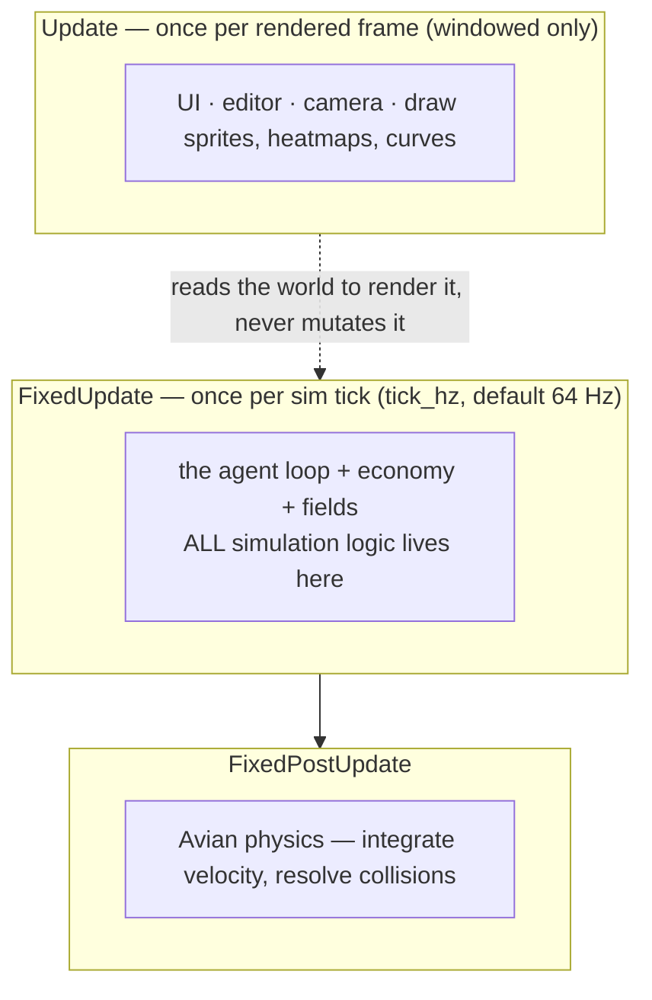
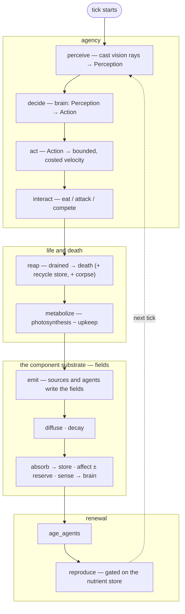
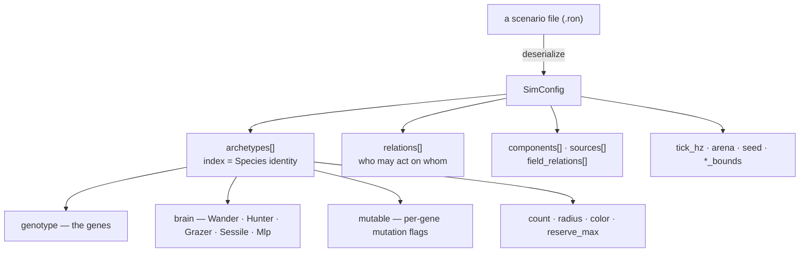

# Architecture

teemlab is one Bevy **plugin** — `SimPlugin` — that advances a world, wrapped in a thin
render/UI layer. The whole simulation is data-driven: a [scenario](./scenario-format.md)
deserializes into a `SimConfig`, and the engine's fixed set of systems interpret it. This
page is the map of that machine — the schedule it runs in, the pipeline of a single tick,
the shape of the data, and the modules.

## One world, two builds

The windowed app and the headless binaries embed the *exact same* `SimPlugin`; only the
layer around it differs (the windowed build adds rendering, the editor and a camera; the
headless builds add nothing). What keeps them identical is one strictly enforced rule
about *where* logic is allowed to run.

## The three schedules

**No simulation logic runs in `Update`.** Agency and the economy live in `FixedUpdate`,
physics in `FixedPostUpdate`; `Update` is only rendering and UI, which *read* the world
but never mutate simulation state. This is the cardinal invariant (DEV Rule 1): because
the sim is untouched by rendering, a headless multi-seed test advances the very world you
would have watched on screen — so tests are a trustworthy proxy, and replays are
deterministic.

## A tick, end to end

Every fixed tick runs one **chained** pipeline of systems, in this exact order:

The **order is load-bearing**, not incidental:

- `interact → reap` (not the reverse): a body grazed to empty **dies before** its
  metabolism could refill it, so a plant grazed empty dies exactly like a fauna starved
  empty — the *uniform* death rule (SIM Law 11), with no ordering tuned to exempt a kind.
- the **field block** sits between `metabolize` and `reproduce`, so an agent's nutrient
  store is filled *before* reproduction reads it to gate a child;
- `reap` also **recycles** — a dying body returns its store to the field, and (with an
  `emit_at_death` relation) leaves a corpse: matter is moved, never created (SIM Law 9).

Every economy/field system **early-returns when inert** (no source, no absorber, diffusion
and decay zero, …), which is why adding the whole field substrate left pre-existing
scenarios byte-for-byte identical (DEV Rule 3).

## The data model

A scenario is pure data; the engine reads it and never writes it back. Everything an
experiment can vary hangs off `SimConfig`:

The archetype's **index is its identity** — `Species(3)` *is* the fourth archetype — and
that index is what the relation table and the field-relation table point at. A "food
source" is not a special type: it is an archetype with a `Sessile` brain living on
photosynthesis. The three
[authors of behaviour](./introduction.md#three-authors-of-behaviour) map onto this tree:
the **engine** is the fixed systems, the **designer** writes this config, and
**evolution** mutates the `genotype` (and a learned brain's weights) at run-time.

## The module map

The crate splits into four layers along the same seam as the schedule — the sim core
never depends on the render layer:

```mermaid
flowchart LR
    subgraph data["data / schema"]
        config["config — SimConfig, Archetype, FieldRelation"]
        genotype["genotype — the genes"]
    end
    subgraph core["sim core — FixedUpdate"]
        components["components — body: Reserve, Nutrients, Perception…"]
        brain["brain — the deciders + MLP"]
        movement["movement — perceive · decide · act"]
        interaction["interaction — the one interaction verb"]
        ecology["ecology — reap · metabolize · age · reproduce"]
        nutrients["nutrients — fields: emit · diffuse · decay · absorb · affect"]
        spawn["spawn — arena + initial population"]
        rng["rng — deterministic PRNG"]
    end
    subgraph obs["observation / render — Update"]
        metrics["metrics — curve history + live stats"]
        dataviz["dataviz — stats · curves · inspector"]
        visuals["visuals — sprites · heatmaps"]
        selection["selection — highlight + ray fan"]
    end
    subgraph outside["outside the sim"]
        breeding["breeding — generational regime"]
    end
    data --> core
    core -. "observation reads the world, never writes it" .-> obs
    breeding -. "orchestrates whole runs" .-> core
```

- **data** — `config` (the `SimConfig` schema + resolvers) and `genotype` (the genes).
- **sim core** (`FixedUpdate`) — `movement` (perceive/decide/act), `interaction` (the one
  interaction verb), `ecology` (reap/metabolize/age/reproduce + the RNG), `nutrients` (the
  component fields), over the ECS `components` (a body), the `brain` deciders, `spawn`
  (arena + population) and the deterministic `rng`.
- **observation** (`Update`, windowed *and* headless-display) — `metrics` (the curve
  history), `dataviz` (stats/curves/inspector), `visuals` (sprites, heatmaps) and
  `selection` (highlighting an agent for inspection).
- **outside the sim** — `breeding`, the generational-regime orchestrator that runs whole
  simulations as tournament matches.

> **The recurring seam.** The schedule, the data model and the module map are the *same*
> boundary seen three ways: data flows in, the fixed core interprets it, and observation
> reads the result without ever writing back. Hold that seam and the rest of teemlab
> follows.
