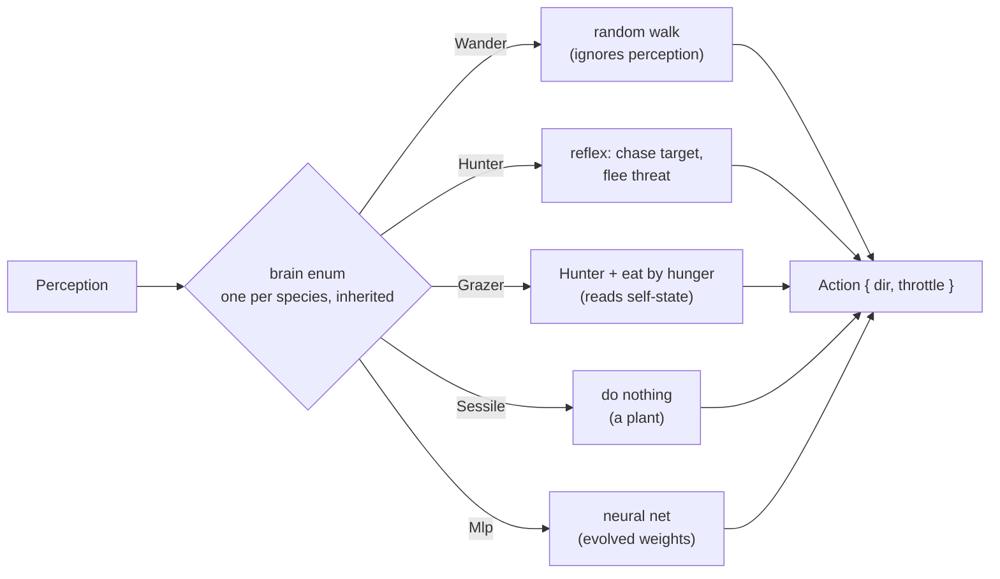

# Brains

A **brain** is an agent's decider: it reads a [`Perception`](./the-loop.md#1-perceive)
and writes an `Action` (`dir` + `throttle`). Its internals are interchangeable behind
that contract, so you pick one per species and it is inherited by offspring. teemlab
ships five, stored as a single `enum` (static dispatch, clean serialization, and an
exhaustive `match` so adding another is a compile error to resolve everywhere).

You choose a species' brain in the [editor](../editor.md) (the **Brain** card) or in the
[scenario file](../scenario-format.md#brain) (`brain: …`).



## `Wander` — the naive control

```ron
brain: Wander(turn_rate: 0.25)
```

A random walk: it **ignores perception entirely** and drifts, turning by a small random
amount each tick (`turn_rate` controls the wobble). It finds food only by stumbling onto
it. This is the *naive baseline* — the bar any "smart" brain must clear. Watch it
squander a costly vision gene it cannot use in the [`evolution`](../scenarios.md#04--evolution)
scenario, where selection melts the eyes away.

## `Hunter` — the competent control

```ron
brain: Hunter
```

A deterministic, stateless reflex that *uses* perception:

- it steers toward the strongest **`target`** channel (charge the nearest prey/food),
- and **away** from the strongest **`threat`** channel (flee the nearest predator).

Because `target` and `threat` are both derived from the [relation table](./interactions.md),
the *same* `Hunter` brain makes one species a herbivore (its target is a plant), another
a carnivore (its target is the herbivore), and a prey that flees (its threat is the
carnivore) — all decided by the relations, not by the brain. It is the *competent*
control: a learned brain that cannot beat it has learned nothing.

## `Grazer` — restraint

```ron
brain: Grazer(hunger_threshold: 0.6)
```

The `Hunter`'s prudent cousin. It forages with the **exact same** steering (toward
`target`, away from `threat`) but eats **deliberately**: it holds its eat/attack intent
only while its own energy reserve is below `hunger_threshold` — reading the
**proprioceptive** `self_state` — and abstains once sated. The threshold *is* the
strategy: `1.0` is **greedy** (it eats whatever is in range, exactly like the hunter),
a lower value is **prudent** (it leaves food uneaten when comfortable).

That single knob is the difference between a persistent ecosystem and a dead one: a
prudent grazer's time-averaged draw on its food is only ~what it needs, so a prudent
population lives sustainably where a greedy one overshoots and collapses. It is the
*deterministic control for restraint* — for deliberate eating what the `Hunter` is for
foraging. See [`17 · Restraint`](../scenarios.md#16-17--the-cognitive-substrate).

## `Sessile` — the plant

```ron
brain: Sessile
```

The trivial brain: it decides nothing and the body does not move. Combined with
`max_speed: 0` and a `photosynthesis` gene, this *is* a plant — a food source that
regrows in place. No special "food" type exists in the engine; a plant is just an agent
wearing this brain.

## `Mlp` — the learned brain

```ron
brain: Mlp(hidden: [10])
```

A small **multi-layer perceptron**, learned by **neuroevolution** (no backprop). Its input
is the per-ray `vision` / `target` / `threat` channels (`3 × rays`), then the scalar
**proprioceptive** channels (its own energy / nutrient / speed) and any **field-sense**
channels (the local concentration of a [component](./nutrients.md#emission--sensing-pheromones)
it senses — a pheromone). It runs them through the hidden layer(s) you specify and outputs
the motor command (steering + the eat/attack intent). Because the exteroceptive channels are
the same ones the `Hunter` reads, an MLP *can* learn to forage and to flee — but it has to
discover how; the extra channels let it also weigh its own state and read chemical trails.

How it learns:

- Founders start with **random weights** — and forage no better than chance.
- Selection keeps the lineages that happen to feed and breed; at reproduction the child
  inherits its parent's weights with a Gaussian perturbation (scaled by `mutation_rate`)
  and **resizes its input layer** if the child's ray count mutated.
- Over generations the population's foraging improves. You can **capture** a good
  individual — freezing its evolved genome *and* concrete weights into a reusable
  archetype — and drop it into a fresh world to start from competence.

A network is not free: `brain_cost` charges energy per decision neuron, so a bigger
brain must earn its keep. The inspector draws the live activation graph (nodes by
activation, edges by weight) when you click an MLP agent.

The three-scenario [MLP learning story](../scenarios.md#07-09--the-mlp-learning-story)
walks through the whole arc: naive → trained → reused.

## Inheritance at reproduction

| Brain     | What a child inherits                                                     |
| --------- | ------------------------------------------------------------------------ |
| `Wander`  | the parent's `turn_rate`, with a fresh random seed.                      |
| `Hunter`  | nothing to carry — deterministic, simply cloned.                        |
| `Grazer`  | the parent's `hunger_threshold` (a fixed strategy, not mutated).         |
| `Sessile` | nothing — cloned.                                                       |
| `Mlp`     | the hidden topology, the weights (mutated), input layer resized to rays. |

Crossover, where it applies, is **intra-type** — you do not cross a neural net with a
state machine.
