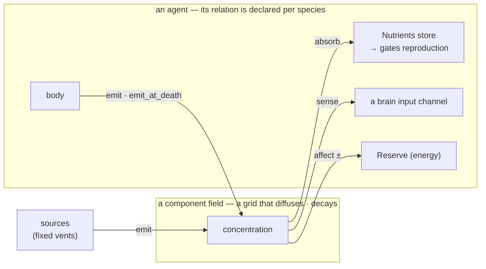

# Components: the environmental substrate

A **component** is teemlab's environmental resource layer — a diffusible substance laid
over the world as a *grid of concentrations*, outside the agents and outside the "every
life form is an agent" law. The engine treats every component the same; what one *means* —
a nutrient, a pheromone, a toxin, biomass — comes only from the **relations** that
reference it (Law 11). The historical first component is the **nutrient**, a mineral that
gates [reproduction](./economy.md#nutrient--the-reproduction-axis); the same machinery now
also carries pheromones (and, by config, toxins).

## The fields

Each component is one concentration field over the arena. A scenario declares them:

```ron
field_resolution: 256,   // cells per side of every field
components: [
    (name: "Nutrient",  diffusion: 0.3, decay: 0.0),   // conserved (a mineral)
    (name: "Pheromone", diffusion: 0.2, decay: 0.05),  // spreads AND fades (a trail)
]
```

- **`diffusion`** — the *local-vs-global* knob: `0` never spreads (stays where emitted),
  higher bleeds outward into smooth gradients. It turns point emissions into **oases**.
- **`decay`** — a per-tick fractional loss: `0` is conserved (a nutrient), positive makes
  the component *fade* (a pheromone trail, decomposing detritus).

Watch any field directly: the renderer draws each as a **heatmap layer** (toggle in
**View ▸ Layers**, or `--components` to the recorder).

## Sources

A component can enter the world from fixed **sources** — think volcanic vents — each
emitting one component at a steady rate:

```ron
sources: [
    (pos: (-150.0, 150.0), component: 0, rate: 12.0, color: (1.0, 0.55, 0.2), radius: 12.0),
    …
]
```

Emission plus diffusion produces a gradient — a bright core fading outward. Vary the
`rate` between sources and you get oases of different sizes — the demonstration in the
[`nutrients`](../scenarios.md#02--nutrients) scenario, where four graded vents grow four
blooms you can read at a glance.

## How a species relates to a component: the `field_relations` table

A species' relationship to each component is **declarative**, not baked into genes — the
environmental twin of the [interaction relations](./interactions.md). One bundled row per
`(species, component)`, listing only the verbs that apply:

```ron
field_relations: [
    // a plant: absorbs the nutrient into a store, spends it to seed a child
    (species: 1, component: 0, absorb: 1.5, capacity: 8.0, repro_cost: 8.0),
    // a forager: no absorption — its store is fed by eating (below) — gated on it
    (species: 0, component: 0,              capacity: 30.0, repro_cost: 8.0),
    // …and it EMITS + SENSES a pheromone (component 1)
    (species: 0, component: 1, emit: 2.0, sense: true),
]
```

The verbs — any subset per row, all independent:

| verb | direction | meaning |
|---|---|---|
| **`absorb`** | field → store | pull the component into a per-agent store (per second) |
| **`capacity`** | — | the store's size for this component |
| **`repro_cost`** | store spent | amount consumed per child — the **reproduction gate** |
| **`emit`** | body → field | write the component into the field (per second) — the *symmetric of absorb* |
| **`emit_at_death`** | body → field | a **fixed biomass** deposited into the field at death — the corpse / carrion a scavenger lives on (distinct from the nutrient store, which recycles separately) |
| **`sense`** | field → brain | the local concentration becomes a **brain input** channel |
| **`affect`** | field → reserve | the concentration changes energy (`< 0` a toxin, `> 0` a boon) |

Each verb is one directed arrow between an agent and a field — the whole substrate is
this handful of edges (the same five verbs whether the component is a nutrient, a
pheromone, a toxin or a corpse):



Because a child is born with an *empty* store, a component gated by `repro_cost` is a
genuine *limiting* resource (Liebig): a species must keep acquiring it to keep breeding.
And because the verbs are independent, one component can be *sensed and harmful* (an
irritant), *harmful without being sensed* (an odorless toxin — humans and CO), or *emitted
and sensed* (a pheromone) — a toxin and a pheromone differ **only** by their relation.

## The food web: nutrient travels by eating

Fauna usually cannot absorb from the ground. Instead the **single interaction primitive**
carries the store up the chain: when a predator eats prey (`transfer: true`), it receives
the share of the prey's store proportional to the biomass it consumed. So a herbivore's
nutrient comes from the plants it eats, a carnivore's from the herbivores — every level's
reproduction coupled to the nutrient flowing up from the soil, which keeps a multi-level
chain bounded without overshoot.

## Recycling: closing the loop

When an agent **dies**, its accumulated store is returned to the field at the cell where it
fell (a brighter spot on the heatmap). Without this, eating would slowly *destroy* the
world's nutrient; with it, matter is *moved*, never created or destroyed — conservation in
spirit. Source → field → plant → herbivore → death → field again: the closed loop you can
watch end-to-end in the [`nutrient_web`](../scenarios.md#12--nutrient-web) finale.

## Emission & sensing: pheromones

The `emit` and `sense` verbs are the **agent → environment** direction — the symmetric of
absorption. An agent *emits* a component into the field during life (organic waste, a
pheromone, a toxin); another *senses* its local concentration as an extra brain input (the
MLP reads it after its proprioceptive channels, exactly as it reads vision or threat).
Emit + sense on a shared component is a **communication substrate** whose meaning is
evolved — watch trails bloom and fade in the [`pheromones`](../scenarios.md#18--pheromones) scenario. (A chemical pheromone and a toxic waste are the same mechanism; the relation
decides.)

> **A known wall.** A closed, well-mixed nutrient loop tends to *oscillate*
> (Lotka–Volterra overshoot) rather than settle into a tidy steady state. The
> `nutrient_web` scenario is built to make the mechanisms *observable*, not to be a
> calibrated equilibrium — it stays lively for a good while, then the overshoot plays out,
> exactly as the dynamics predict.
